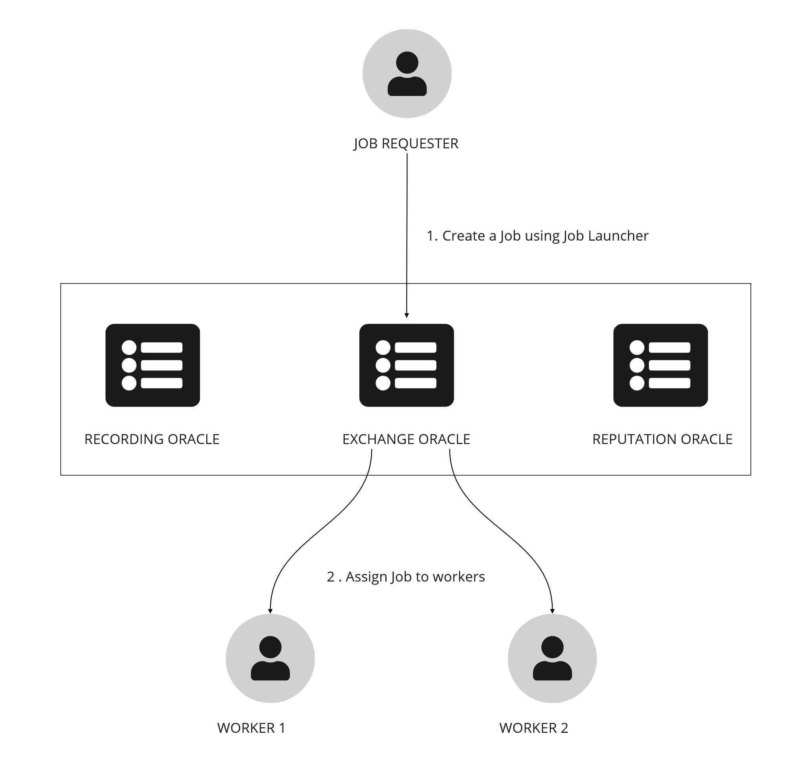
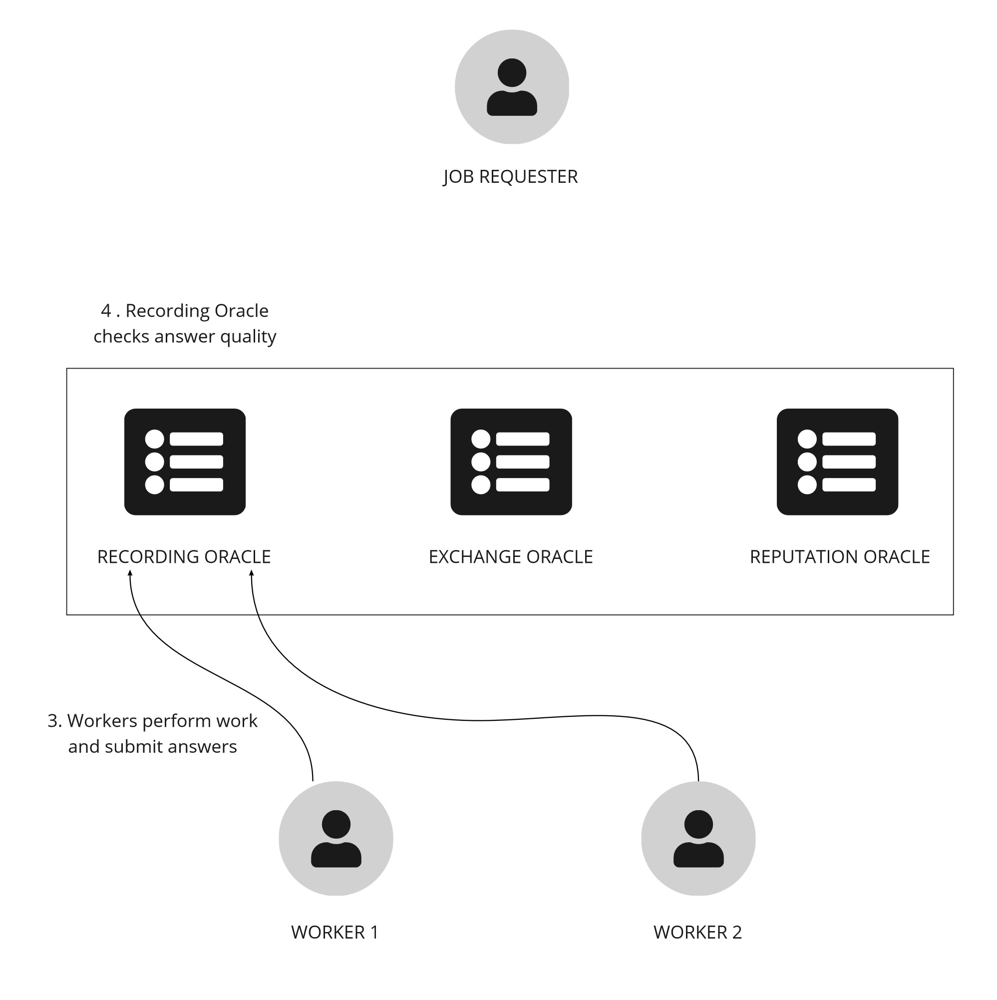
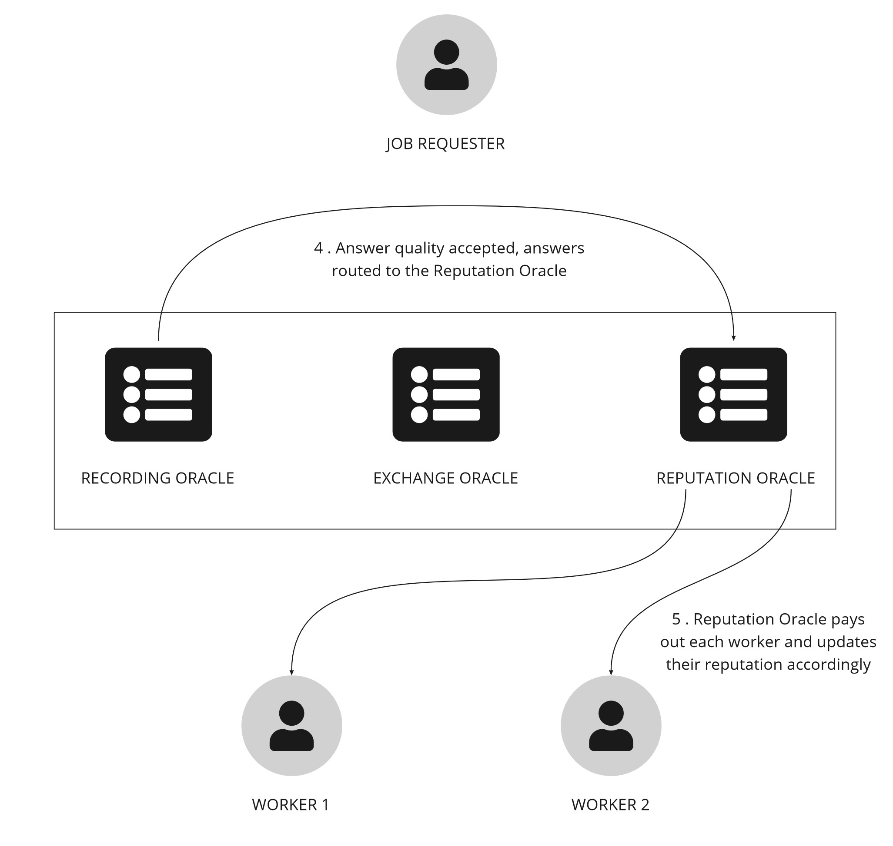

# Fortune

Welcome to Fortune, an example HUMAN application that demonstrates how to create and fulfill job requests using the HUMAN protocol.

## How it works

In this specific usecase a job requester is requesting a fortune prediction from a group of workers (Fortune Tellers). Each Fortune Teller will provide their answers, which will then be verified and settled by a group of Oracles.

## High Level Overview

At a very high level this project consists of 4 main components:

**Launcher (Job Launcher)** - The Job Launcher is factory which creates new escrow contracts. A job requester can then add Job details (as a mainfest) and fund the escrow.

**Exchange Oracle** - An Ethereum Oracle that interacts with people or bots to fufill the job.

**Recording Oracle** - An Ethereum Oracle which records the task output and who does what. In this case, the recording oracle will receive response from workers (Fortune Tellers).

**Reptutation Oracle** - An Ethereum Oracle which pays workers for the jobs performed, based on their reputation within the oracle network. In this case, the reputation oracle collects all the responses from the recording oracle and pays out the Worker and Recording Oracle.

### User Persona's in this demo

**Job Creator/Requester** - The entity/person who wants some work performed.

**Worker (Fortune Teller)** - The entity/person who performs the actual work.

## Process Flow

### Job Submission and Routing

1. Job creator creates an escrow using the job launcher 
2. Once the job is registered on-chain the Exchange picks up the job and routes it to workers.



### Job Fulfillment and Answer Quality

3. Workers perform the task and submit their responses(answers) to the Recording Oracle..
4. Recording Oracle checks the quality of answers. If the quality is acceptable the answers are routed to the Reputation Oracle.



### Settlement
5. Reputation Oracle calculates a threshold based on job request parameters. If the answers pass the threshold it pay workers and updates the reputation scores for each worker.



## Usage Instructions

There are two options to run the example, use our deployed plaground example or run the example locally using Docker.

## Deployed Playground

To use the hosted example all you need is a metmask wallet with the Fortune Ethereum Testnet configured. Download and install Metamask from www.metamask.io.

### Metamask Configuration for Deployed Playground

To configure Metamask for the deployed playground example:

1. Open your Metamask wallet and click on the account icon in the top right. Select Settings > Networks > Add Network. Enter the details below:

- New RPC URL - http://ec2-3-15-230-238.us-east-2.compute.amazonaws.com:8545
- Chain ID - 1337 (you may get a warning here that this ID is already in use, it is safe to ignore)
- Currency Symbol - ETH

2. Next we will need 3 accounts to represent each person in this example (Job requester, Worker 1 and Worker 2). In Metamask, click on your account icon in the top right and select Import Account. From this screen you can enter a private key to add an account. Repeat this process for each of the keys below:

#### Job Requester

`28e516f1e2f99e96a48a23cea1f94ee5f073403a1c68e818263f0eb898f1c8e5`

#### Worker 1

`9e531b326f8c09437ab2af7a768e5e25422b43075169714f1790b6b036f73b00`

#### Worker 2

`9da0d3721774843193737244a0f3355191f66ff7321e83eae83f7f746eb34350`

(In case you are wondering where these keys are from, they are the standard accounts from a Ganache setup and are pre-funded with testnet HMT).

3. The final step in configuring Metamask is to import the HMT Token for each of the accounts. Click on 'Import tokens', located at the bottom of the 'Assets' tab on your wallet homepage and add the following Token Contract Address for the HMT Token: `0x444c45937D2202118a0FF9c48d491cef527b59dF`
Repeat this process for each of the 3 accounts. Now we have successfully configured Metamask we can proceed to interact with the Job Launcher to create new Job Requests.

## Creating a Job (Deployed Playground)

In Metamask, switch to the Job Requester account that you imported above

1. Ensure that you are connected to Fortune Ganache (or whatever you named it above) under Networks in Metamask.
2. Navigate to http://ec2-3-15-230-238.us-east-2.compute.amazonaws.com:3000 to access the Job Launcher
3. Click on connect to connect your metamask wallet
4. To begin deploying a new job click on 'Create Escrow', Metamask will ask you to sign this transaction
5. Assuming the above transaction was successful you will now have a new Escrow address under the "Escrow created" field, this address represents the job, copy it down.  Next we must fund the escrow.
6. Enter the Escrow address in to the search box and click the 'Search Escrow' button.  You should now be presented with information about the Escrow, such as the status etc.  Enter any amount into the box titled 'Fund the escrow' and click the 'Fund' button.
7. To complete the job creation process we must add the manifest URL.  This URL points to the manifest.json file, which contains job specific data.  For this example the data is already created for you and stored in a local datastore (minio) which can be accessed at http://ec2-3-15-230-238.us-east-2.compute.amazonaws.com:9001 (To login you must use the default username: 'dev' and password 'devdevdev')
7. Once you are into the minio dashboard, click on the 'Browse' button, then click on the manifest.json file. Click the 'share' button to get the manifest url. 
8. Enter the manifest URL into the form and hit 'Setup Escrow'.

The job creation is now complete!

## Viewing Jobs

The job has now been created and is available for exchanges to pick up.  To view the job status navigate to http://ec2-3-15-230-238.us-east-2.compute.amazonaws.com:3001 and paste in the Escrow contract address.  The status should be 'Pending'.  Jobs in a pending status are picked up by the exchange and forwarded to workers.

## Fulfilling a job
To fulfil this job we require answers (fortunes in our case) from 2 workers. 
1. In your Metamask wallet switch to the Worker 1 account that we imported above.  Navigate to http://ec2-3-15-230-238.us-east-2.compute.amazonaws.com:3001 and enter a fortune prediction (any text).
2. Now switch to Worker 2 and enter a fortune prediction (it should be different from Worker 1).

We have now provided 2 predictions from 2 Workers. Lets check the status of the job again by navigating to http://ec2-3-15-230-238.us-east-2.compute.amazonaws.com:3001/


PROBLEM: Cannot run playground version as the Create Escrow Transaction is expecting ETH. The wallets provided above only have HMT and so I am unable to create the escrow. I have followed the readme exactly, must investigate. Question when accessing the playground example are these accounts freshly generated or are they persisted. If they are persisted this could explain why they have no ETH (it has all be used up).

===================================================================================================

## Running Locally

To run the example locally, you will require Docker. Please see this guide for Docker installation instructions. Once Docker is installed and running, from the root of the project run:

```
docker-compose up // Bring up docker env
```

To deploy contracts to the blockchain, in a new window execute:

```
cd contracts && yarn && yarn deploy
```

At this point we have a local testnet running and our contracts deployed to this testnet. The next step is to configure Metamask to work with our Local Testnet.

### Metamask Configuration for Local Testnet

To configure Metamask for the Local Testnet example:

1. Open your Metamask wallet and click on the account icon in the top right. Select Settings > Networks > Add Network. Enter the details below:

- Network Name - any name. We are using `Fortune Ganache` for this example
- New RPC URL - http://localhost:8547
- Chain ID - `1337` (you may get a warning here that this ID is already in use, it is safe to ignore)
- Currency Symbol - `ETH`

2. Next we will need 3 accounts to represent each person in this example (Job requester, Worker 1 and Worker 2). In Metamask, click on your account icon in the top right and select Import Account. From this screen you can enter a private key to add an account. Repeat this process for each of the keys below:

#### Job Requester

`28e516f1e2f99e96a48a23cea1f94ee5f073403a1c68e818263f0eb898f1c8e5`

#### Worker 1

`9e531b326f8c09437ab2af7a768e5e25422b43075169714f1790b6b036f73b00`

#### Worker 2

`9da0d3721774843193737244a0f3355191f66ff7321e83eae83f7f746eb34350`

## Creating a Job (Local Testnet)

In Metamask, switch to the Job Requester account that you imported above

1. Ensure that you are connected to Fortune Ganache (or whatever you named it above) under Networks in Metamask.
2. Navigate to http://localhost:3000 to access the Job Launcher
3. Click on connect to connect your metamask wallet
4. To begin deploying a new job click on 'Create Escrow', Metamask will ask you to sign this transaction
5. Assuming the above transaction was successful you will now have a new Escrow address under the "Escrow created" field, this address represents the job, copy it down.  Next we must fund the escrow.
6. Enter the Escrow address in to the search box and click the 'Search Escrow' button.  You should now be presented with information about the Escrow, such as the status etc.  Enter any amount into the box titled 'Fund the escrow' and click the 'Fund' button.
7. To complete the job creation process we must add the manifest URL.  This URL points to the manifest.json file, which contains job specific data.  For this example the data is already created for you and stored in a local datastore (minio) which can be accessed at http://localhost:9001 (To login you must use the default username: 'dev' and password 'devdevdev')
7. Once you are into the minio dashboard, click on the 'Browse' button, then click on the manifest.json file. Click the 'share' button to get the manifest url. 
8. Enter the manifest URL into the form and hit 'Setup Escrow'.

The job creation is now complete!

## Viewing Jobs

The job has now been created and is available for exchanges to pick up.  To view the job status navigate to http://localhost:3001, and paste in the Escrow contract address.  The status should be 'Pending'.  Jobs in a pending status are picked up by the exchange and forwarded to workers.

## Fulfilling a job
To fulfil this job we require answers (fortunes in our case) from 2 workers. 
1. In your Metamask wallet switch to the Worker 1 account that we imported above.  Navigate to http://localhost:3001 and enter a fortune prediction (any text).
2. Now switch to Worker 2 and enter a fortune prediction (it should be different from Worker 1).

We have now provided 2 predictions from 2 Workers. Lets check the status of the job again by navigating to http://localhost:3001
You should also see the account balances for Worker 1 and 2 have increased by the relevant amount.  The 'final results URL' can be found by navigating to the Job Launcher (http://localhost:3000).

# Conclusion

In this example we have demonstrated the steps involved in creating & fulfilling jobs on the HUMAN protocol.  This is a very basic example and could quite easily be extended to other use case's.  If you have any problems with the setup please open an issue and let us know!  Feel free to check out the HUMAN github repostory for other useful resources.